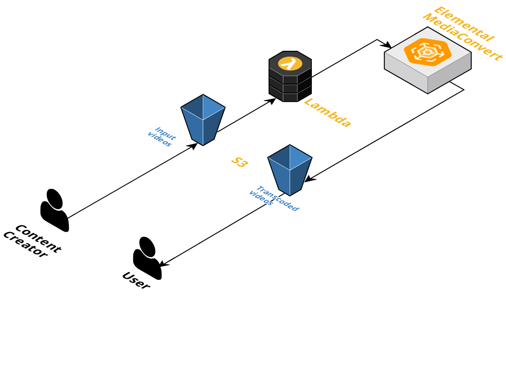

# **AWS Video On Demand**

AWS video on demand infrastructure written in **Terraform**

## AWS Elemental MediaConvert

> AWS Elemental MediaConvert is a file-based video transcoding service that allows you to easily create video-on-demand (VOD) content for broadcast and multiscreen delivery at scale without having to worry about the complexity of building and operating your own video processing infrastructure. This terraform module is used to set an automated workflow in order to transcode videos with your configuration.

## **Introduction**

We have developed an Video On Demand Workflow using various services of the AWS Serverless Ecosystem. We are going to focus mainly on the backend of the application.



## Terraform versions

Terraform 0.12 and newer.

## Requirements

| Name | Version |
|------|---------|
| terraform | >= 0.12 |
| aws | >= 2.11 |

## Providers

AWS

## Prerequisites

* You must retrieve your **AWS Elemental MediaConvert API endpoint** (account specific). For that use aws-cli and keep the given endpoint:

```sh
$ aws mediaconvert describe-endpoints

{
    "Endpoints": [
        {
            "Url": "https://abcd1234.mediaconvert.us-west-2.amazonaws.com"
        }
    ]
}
```

* Authentication: Create AWS Profile `terraform_admin`

```
$ aws configure --profile terraform_admin

AWS Access Key ID: yourID
AWS Secret Access Key: yourSecert
Default region name : aws-region
Default output format : env
```

## Deployment Instructions

Clone our repository where you plan to use this module.\
Open file **var.tf** in your preffered editor and change required variables and save the file.

Run following commands in root directory of project

###### Note: deploy.sh file is compatible for MacOS you can change it according to your OS

```
bash deploy.sh
```

Output

```
SOURCE_S3_BUCKET = "video-on-demand-source-bucket-e23ae6f7fd40aee3"
DESTINATION_S3_BUCKET = "video-on-demand-destination-bucket-e23ae6f7fd40aee3"
```

## Testing

What does it do ?

* I upload a file _my_video_***.mp4*** to the ***SOURCE_S3_BUCKET*** bucket.
* The video file match with **bucket_event_suffix**.
* The lambda function is triggered and start MediaConvert job.
* Output video(s) are generated in the ***DESTINATION_S3_BUCKET*** bucket.
* As soon as MediaConvert job completes it will send email notification with video streaming url to mail address set in **var.tf** file.

Open aws s3 console and upload video file to bucket SOURCE_S3_BUCKET

After some time you will get email notification with video streaming url to mail address set in **var.tf** file, you can use those endpoint to play video in any suppported web players like AWS IVS Player.

## Clean Up

Run following command in root directory

```
terraform destroy
```
